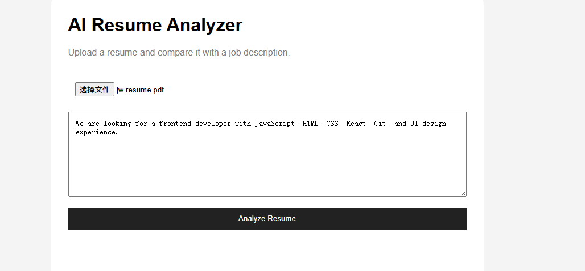
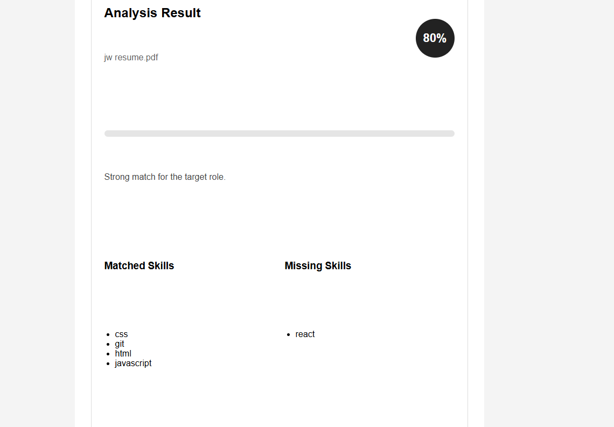

# Live Demo

https://resume-analyzer-6pdw.onrender.com

# AI Resume Analyzer

A full-stack resume analysis web application built with FastAPI, Python, HTML, CSS, and JavaScript.

The system analyzes a resume PDF, extracts technical skills, compares them with a target job description, and generates structured feedback on skill alignment and missing keywords.

---

# Features

- Upload PDF resumes
- Extract resume text automatically
- Detect technical skills from resumes
- Compare resumes with job descriptions
- Match score calculation
- Missing skills detection
- Structured improvement feedback
- Frontend + backend integration
- REST API architecture with FastAPI
- Modular backend structure
- Logging and validation support
- Optional OpenAI embedding-based semantic scoring
- Local fallback semantic scoring when OpenAI API is unavailable
- Semantic source display in frontend results

---

## Recent Improvements

- Added skill normalization for aliases such as JS, ML, RESTful APIs, and Fast API
- Added weighted scoring for more realistic resume ranking
- Added phrase-level matching for AI models and backend systems
- Improved feedback generation for missing technical skills
- Added semantic-style preprocessing for resume and job description text

# Tech Stack

## Backend
- Python
- FastAPI
- Uvicorn
- OpenAI API
- python-dotenv

## Frontend
- HTML
- CSS
- JavaScript

## Other Tools
- Git
- GitHub
- Jinja2
- pypdf

---

# Project Structure

```text
resume-analyzer/
│
├── app/
│   ├── routers/
│   ├── services/
│   ├── schemas/
│   ├── skills.py
│   ├── utils.py
│   └── main.py
│
├── static/
├── templates/
├── assets/
├── requirements.txt
├── render.yaml
└── README.md
```

---


## Semantic Matching

This project supports two semantic scoring modes:

1. **OpenAI Embeddings**
   - Uses OpenAI embeddings when `OPENAI_API_KEY` is available and `USE_OPENAI_EMBEDDINGS=True`

2. **Basic Local Fallback**
   - Uses a lightweight local fallback when OpenAI credentials are missing or disabled

This keeps the project usable both with and without external AI services.

---

## Environment Variables

Create a local `.env` file based on `.env.example`:

```env
OPENAI_API_KEY=your_api_key_here
USE_OPENAI_EMBEDDINGS=True

---

# Screenshots

## Homepage



---

## Analysis Results



---

# How It Works

1. User uploads a PDF resume
2. Backend extracts text from the PDF
3. Resume skills are identified
4. Skills are compared against a job description
5. Match score and feedback are generated
6. Results are displayed in the frontend UI

---

# Run Locally

## Clone repository

```bash
git clone https://github.com/Jiawei-15/resume-analyzer.git
```

---

## Install dependencies

```bash
pip install -r requirements.txt
```

---

## Start server

```bash
uvicorn app.main:app --reload
```

---

## Open browser

```text
http://127.0.0.1:8000
```

---

## Run with Docker

```bash
docker build -t resume-analyzer .
docker run -p 10000:10000 resume-analyzer

# Future Improvements

- Semantic similarity matching
- OpenAI integration
- Better NLP ranking
- Resume recommendations
- Deployment to Render
- Database support

---

# Author

Built as a portfolio backend/full-stack project focused on resume analysis and API architecture.