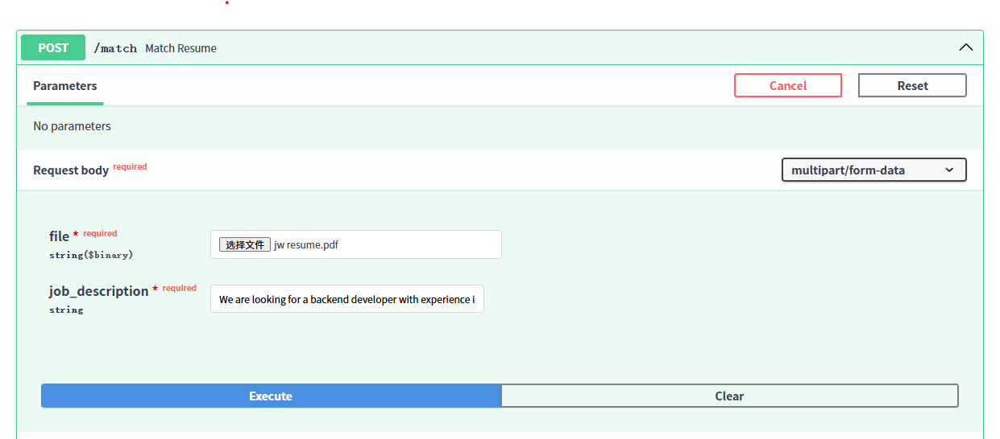
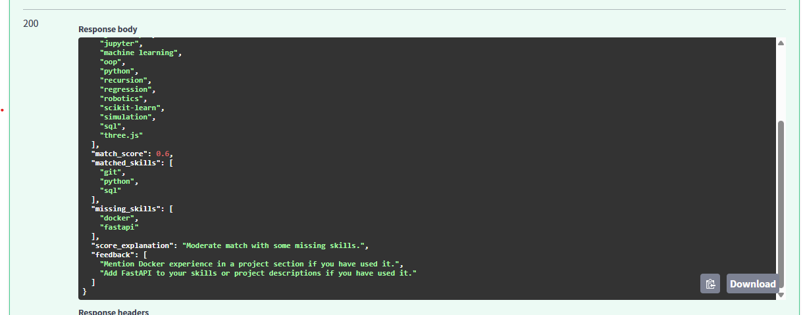

# AI Resume Analyzer

A FastAPI-based backend project that analyzes PDF resumes against job descriptions and returns structured feedback.

---

## Features

- PDF resume parsing
- Skill extraction
- Job description matching
- Match score generation
- Missing skill analysis
- Resume improvement feedback

---

## Demo

### Match Endpoint Input



### Sample Match Result



---

## Tech Stack

- Python
- FastAPI
- pypdf
- Regex-based text processing

---

## Run Locally

```bash
uvicorn app.main:app --reload
=======
# Resume Analyzer

A practical Python project that compares a resume against a job description and returns structured feedback on keyword alignment, skill coverage, and weak points.

This project was built as a useful job-search tool rather than a classroom-only demo. The main idea is simple: instead of reading a resume as just a block of text, the system breaks it down, compares it with a target role, and highlights where the resume is strong and where it may be missing important signals.

## What it does

- reads resume text and job description text
- preprocesses and cleans the text
- identifies important keywords and skill-related terms
- compares overlap between the resume and the target role
- returns structured feedback on:
  - keyword alignment
  - skill coverage
  - weak or missing areas
  - overall match quality

## Why I built it

I wanted to build something more practical than a standard class project. Resume screening is a real-world problem, and it gave me a way to work on applied AI and text processing while still building something that feels useful.

I also wanted the project to be readable and easy to improve. Instead of overcomplicating the design early, I focused on clear output, simple comparison logic, and a workflow that can be tested and refined over time.

## Tech stack

- Python
- NLP / text processing
- keyword extraction and matching
- structured comparison logic
- iterative testing and improvement

## Project goals

This project focuses on:

- useful output instead of just technical experimentation
- clear comparison between a resume and a target role
- readable feedback that points out strengths and weak areas
- building applied AI skills through a practical use case

## How it works

The general pipeline is:

1. load resume content and job description content
2. clean and normalize the text
3. extract relevant terms, keywords, and skills
4. compare the two sides for overlap and gaps
5. generate structured feedback based on the comparison

The result is not meant to replace a recruiter. It is meant to provide a more organized way to review resume-job fit and spot possible weaknesses before applying.

## Skills demonstrated

This project demonstrates:

- Python project development
- applied AI in a practical workflow
- NLP and text preprocessing
- comparing unstructured text in a structured way
- turning technical logic into output that is actually usable
- improving a project through testing and iteration

## Running the project

Clone the repository:

```bash
git clone https://github.com/Jiawei-15/resume-analyzer.git
cd resume-analyzer
>>>>>>> a05d5ebc6083bd6a7979988ff15f771202d6df6c
